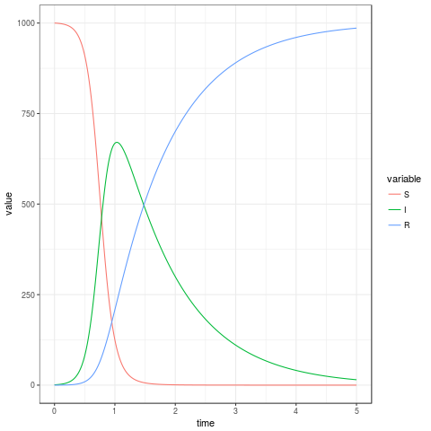
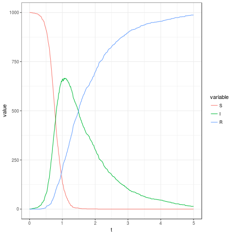
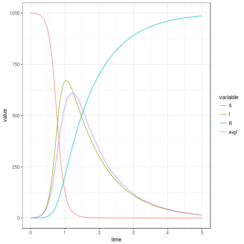
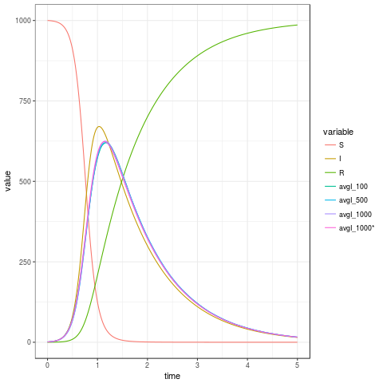

# SIR Model

The files in this repository implement two stochastic simulators for the SIR model presented in exercise.pdf. The main files are:
* sir.R: Implementation of SIR as a deterministic model (as a set of differential equations passed to an ODE solver) and as a stochastic model using population-based simulation.
* sir2.R: Presents a reworking of the first simulator by implementing a simulator generator that takes an input a descrition of the stochastic model (events and rate formulae) - an attempt to a more general approach.
* run_sir.R: Sample code that uses both simulators. 

The code presented in the following sections can be found in run_sir.R

## Deterministic Model

The deterministic solves the SIR differential equations defined by `sir.ode` by calling deSolve.ode on some initial values and parameters. The derivatives are defined in file sir.R:
```
sir.ode <- function(t,state,params) {
  with(as.list(c(state, params)), {
    N <- S+I+R
    dS <- -beta*S*I/N
    dI <- beta*S*I/N - sigma*I
    dR <- sigma*I
    return(list(c(dS, dI, dR)))
 })
}
```

The initial condition and parameters are the same thoughout the example:
```
t0 <- 0
t1 <- 5
params <- c(beta=10,sigma=1)
state0 <- c(S=1000,I=1,R=0)
```
The solver is called as follows:
```
source("sir.R")
timesODE <- seq(t0,t1,by=0.005)
sir.ode.model <- gen.ode.model(f=sir.ode)
sirODEdf <- sir.ode.model(state=state0,times=timesODE,params=params)
plotODE <- gen.plot.ode(sirODEdf)
print(plotODE)
```
The function `sir.ode.model` calls the solver and returns a dataframe with the complete timeseries. The dataframe can be plotted by `gen.plot.ode`.




## Stochastic Model v1

The stochastic simulator generator (`gen.simulator`) needs a stepper function as input. The stepper function implements the changes to state ocurred during a time step `dt` i.e. it essentially implements the stochastic functionality of SIR. The generated similator loops over a timeseries, repeatedly calling the stepper function to update the state, and returns a list of dataframes, one per simulation. The stepper function for SIR is:
```
sir.dt <- function(t,dt,state,params) {
 with(as.list(c(state, params)), {
    N <- S+I+R
    probSI <- beta*I*dt/N # infection
    probIR <- sigma*dt    # recovery
    flowSI <- rbinom(n=1,size=S,prob=probSI)
    flowIR <- rbinom(n=1,size=I,prob=probIR)
    # removed list constructor
    return(c(-flowSI, flowSI-flowIR, flowIR))
 })
}

```

We can create and run the simulator as follows:
```
dt = 0.01
timesSim = seq(t0,t1,by=dt)

sim.sir <- gen.simulator(f.dt=sir.dt)
set.seed(0)
simDfs <- sim.sir(state0=state0,params=params,times=timesSim,nsim=10)

print( gen.plot.sim(simDfs[[3]]) )
```
Above, we have ran 10 simulations and plotted the dataframe generated by the third simulation:



Let say we are interested in identifying the peaks of each simulation:
```
peaksI <- sapply(simDfs,function(simDf) get_peak(simDf,'t','I'))
peaksI
       [,1]   [,2]   [,3]   [,4]   [,5]   [,6]   [,7]   [,8] [,9] [,10]
t      1.01   1.03   1.05   1.15   1.35   1.23   1.17   0.88    0   1.5
deme 682.00 664.00 666.00 666.00 659.00 690.00 694.00 715.00    1 687.0
```
We can see that they occur between times 1.01 and 1.5, which the exception of the 9th simulation that 'never took off' (you can plot simDfs[[9]] to check). Let's average the 'good' simulations in order to compare (plot) them with the ODE results:
```
badSims <- which(peaksI[2,]<=1)
simDfs <- simDfs[-badSims]
meanIpeak <- mean(peaksI[2,-badSims])
meanTpeak <- mean(peaksI[1,-badSims])
print(c(meanTpeak, meanIpeak))
nsims <- length(simDfs)
avgI <- lapply(seq(length(timesSim)), 
       function(t) mean(sapply(seq(nsims), function(nsim) simDfs[[nsim]][t,'I'] )))
approxAvgI <- approx(timesSim,avgI,timesODE)
sirCmpDf <- sirODEdf
sirCmpDf[,'avgI'] <- approxAvgI$y
plotCmpI <- gen.plot.ode(sirCmpDf)
print(plotCmpI)
```



The averages of the peak times and vules for I are 1.522 and 680.33, respectively.

## Stochastic Model v2

After coding our first SIR simulator we have noted that in order to implement a more general function we need to define our stochastic model by specifying:
* The compartments of the model
* The events the govern the dynamics of the system in terms of the rates at which they occur, and the changes to the system they trigger.

Event types a created by calling the  `make_event` function. It requires three pieces of information: the event's name, the source of the event and changes to the system (state) that the ocurrence of a single event will trigger. Our SIR model requires the following event types:
```
stateNames <- c('S','I','R')
sirEvents <- list(
	  make.event('infection','S', list('I'=1,'S'=-1)),
	  make.event('recovery', 'I', list('I'=-1,'R'=1))
	  )
```
Note that there's no information describing the event rates - we found it more convinient to group the calculation of all event rates in a single rates function (though single functions could've been created for each):
```
sir.rates.dt <- function(state,params,t,dt) {
  rates <- numeric(2) # must equal to number of events
  with(as.list(c(state, params)), {
    N <- S+I+R
    return(c( (beta*I/N)*dt, sigma*dt   ))
 })
}
```
The stochastic model simulator is created, and executed  as follows:
```
sim.sir2 <- gen.model.simulator(stateNames,sirEvents,sir.rates.dt)
set.seed(0)
sirDfs2 <- sim.sir2(state0,params,timesSim,nsim=10)
```

The output has the same format as the previous simulator so the  same commads can be executed to perform similar 'checks'.

The following graph plots the averages of several simulation runs (11, 500, 1000) against the base ODE result:




